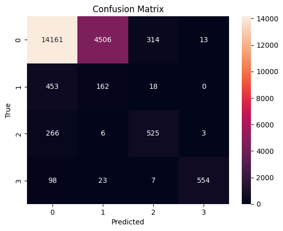

# ECG Arrhythmia Classification using MIT-BIH Dataset

## Project Overview
This project implements an end-to-end deep learning pipeline for automated heartbeat classification using the MIT-BIH Arrhythmia Dataset. The system performs ECG signal preprocessing, heartbeat segmentation around R-peaks, patient-level data splitting to prevent leakage, class imbalance handling using weighted sampling, and training of a CNN model for multi-class arrhythmia detection.

## Dataset
The dataset used is the MIT-BIH Arrhythmia Dataset from PhysioNet.
- **Source:** PhysioNet
- **Records:** 48 half-hour two-channel ambulatory ECG recordings
- **Sampling Frequency:** 360 Hz
- **Annotations:** Beat-level annotation provided by cardiologists

The model is trained on standard heartbeat categories (AAMI EC57 standard grouping):
- N: Normal beat
- S: Supraventricular ectopic beat
- V: Ventricular ectopic beat
- F: Fusion beat
- Q: Unknown beat (removed during preprocessing)
- 
Although the dataset provides two ECG channels per record, this implementation uses only a single lead (MLII) for heartbeat classification.
The dataset is not included in this repository. Users must download it directly from PhysioNet.

## Data Preprocessing
- ECG signal loading using **wfdb**.
- R-peak extraction using annotation files.
- Fixed-length window segmentation around each R-peak.
- Removal of noisy or invalid beats.
- Removal of Q-class beats.
- Patient-level group-aware train/validation/test split (Train: 64%, Validation: 16%, Test: 20%).
- Class imbalance handling using WeightedRandomSampler for training.

NOTE: The dataset split is performed patient-wise to prevent data leakage.

## Model Architecture
The proposed model is a 1D Convolutional Neural Network (CNN) designed for single-beat ECG classification.

Each input consists of a 0.6-second heartbeat segment (216 samples) centered around the R-peak. The architecture includes:
```
Input: 1 × 216

Conv1D(32, kernel=7, padding=3)
BatchNorm1D
ReLU
MaxPool1D(2)

Conv1D(64, kernel=5, padding=2)
BatchNorm1D
ReLU
MaxPool1D(2)

Conv1D(128, kernel=3, padding=1)
BatchNorm1D
ReLU

Global Average Pooling

Fully Connected (128 → 4)
```

The architecture focuses on morphological feature learning. The decreasing receptive field (7 -> 5 -> 3) enables hierarchical feature extraction allowing the network to first model waveform morphology (e.g., QRS complexes) and then refine localized temporal variations.

## Training Setup
- Loss Function: CrossEntropyLoss
- Optimizer: Adam
- Learning Rate Scheduler: ReduceLROnPlateau
- Batch Size: 64
- GPU: NVIDIA T4 (Colab)
- Model checkpoint based on best validation performance

Note: Random seeds and deterministic settings were fixed for reproducibility.

## Results
The model is evaluated on a held-out test set (patient-level split).
### Overall Metrics

| Metric            | Value      |
|-------------------|------------|
| Overall Accuracy  | 72.96%     |
| Macro F1 Score    | 0.6026     |

---

### Class-wise Performance

| Class                        | Precision | Recall  | F1 Score |
|------------------------------|-----------|---------|----------|
| 0 (Normal)                   | 0.9455    | 0.7456  | 0.8337   |
| 1 (Supraventricular ectopic) | 0.0345    | 0.2559  | 0.0608   |
| 2 (Ventricular ectopic)      | 0.6076    | 0.6562  | 0.6310   |
| 3 (Fusion)                   | 0.9719    | 0.8123  | 0.8850   |

---

### Confusion matrix


## Key Insights
- The model performs strongly on Normal (F1 = 0.83) and Fusion beats (F1 = 0.89), indicating robust feature extraction using 1D CNNs.
- Ventricular ectopic beats achieve balanced performance (F1 = 0.63), showing reliable abnormal beat identification.
- Supraventricular beats remain challenging (F1 = 0.06) due to morphological similarity with Normal beats and absence of rhythm context in single-beat modeling.
- Patient-wise splitting ensures leakage-free and clinically meaningful performance assessment.
- Although the overall accuracy is 72.96%, the Macro F1 score of 0.6026 highlights the impact of class imbalance. Macro F1 provides a more reliable evaluation metric than accuracy in this imbalanced medical classification setting.
  
## How to Run
Run on Google Colab (Recommended)
- Open the notebook in Google Colab.
- Download the MIT-BIH dataset from PhysioNet:
- Upload the dataset from your Google Drive.
- Run all cells sequentially.
- A pretrained model is provided at:
models/best_model.pth
You may load this directly for evaluation without retraining.

Note: The project was developed and tested using Python 3.12.12. 
